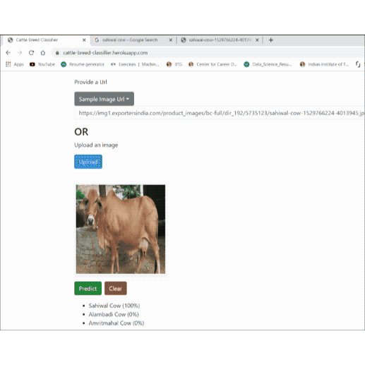

# Training the Image Classifier & Creating a Web App 🐄🖥️
## Indigenous Cattle Breed Classifier Web App

This innovative project was spearheaded by [Ajit Kumar Singh](https://www.linkedin.com/in/sajit9285/), focusing on the development of a web application capable of classifying indigenous cattle breeds. 

### Tech Stack 🛠️
For **model training**, the following technologies were employed (detailed in [requirements.txt](requirements.txt)):
- PyTorch: version 2.1.2 🚀
- Python: version 3.9 🐍

For **model deployment**, these tools brought the project to life:
- Render 🌐
- Flask: version 1.0.2 🌟

## Table of Contents 📚
1. [Training the Model](docs/1_training.md) with PyTorch: [Indigenous_Cattle_Breed_Classifier](https://github.com/sajit9285/cattle-breed-classifier-webapp/blob/master/notebooks/Indigenous_Cattle_Breed_Classifier.ipynb) 🏋️‍♂️
2. [Deploying the App on Render](docs/2_render_app.md): Discover the web app [**here**](https://indigenous-cattle-breed-classifier-web.onrender.com) 🚀

## Demo 🎥
Catch a glimpse of the app in action!

## References 

* Render deployment pytorch model <a href="https://github.com/render-examples">render-examples</a> 

 

 
 
 

