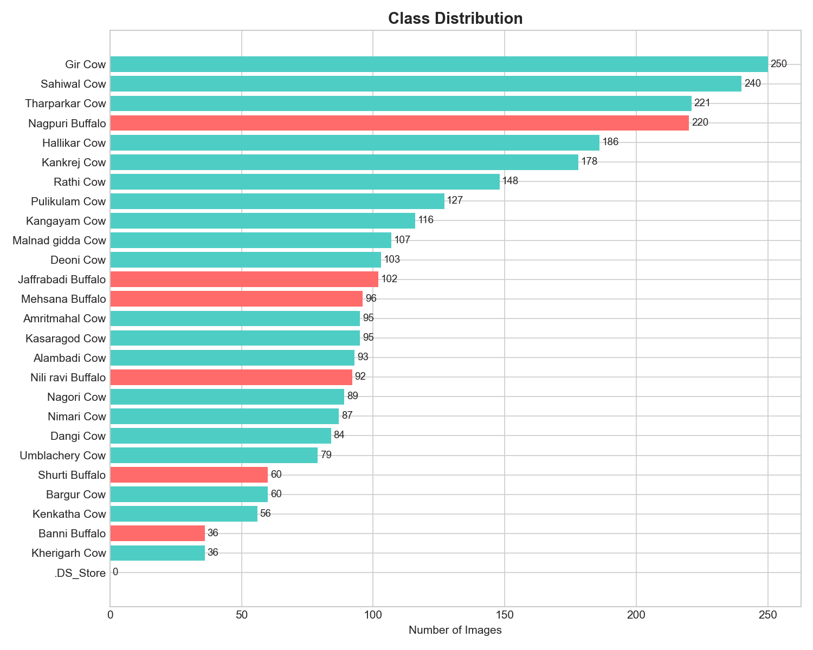
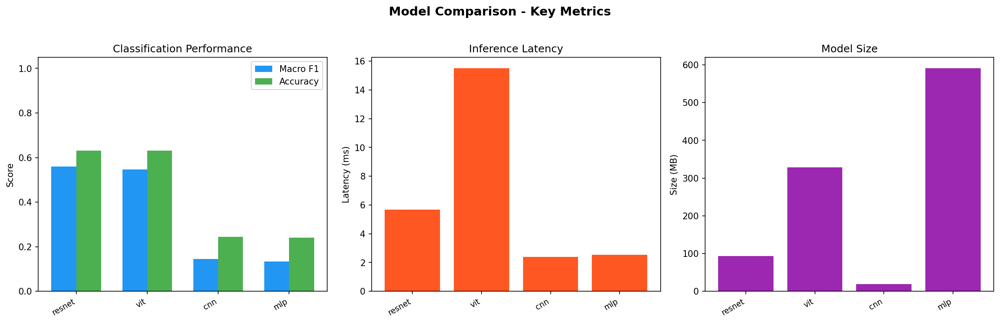
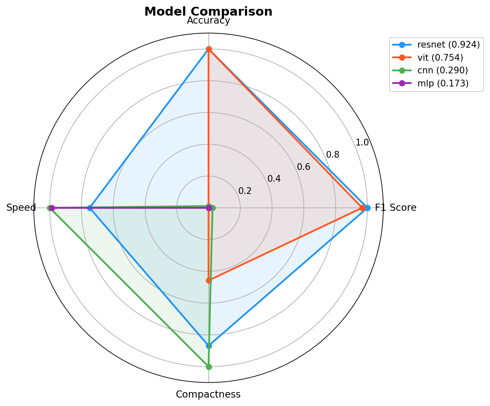

# 🐄 Indigenous Cattle Breed Classifier

Identifying indigenous Indian cattle and buffalo breeds requires specialized domain expertise that many farmers and agricultural workers may lack. Proper identification is critical for optimizing milk yield projections, managing livestock lifespans, and preserving regional biodiversity. 

This project solves this by delivering an end-to-end deep learning pipeline and an accessible web application capable of identifying **26 distinct indigenous cattle and buffalo breeds** from an image.

    

### 🟢 Live Demo
**Test the fully deployed Vision Transformer natively in the browser here:**
👉 **[https://huggingface.co/spaces/sajit9285/cattle-breed-classifier](https://huggingface.co/spaces/sajit9285/cattle-breed-classifier)**

---

## 📊 Data Gathering & Information

The foundation of any robust computer vision model is its data. Our dataset comprises thousands of images distributed across 26 target classes, which include **21 Cow breeds** and **5 Buffalo breeds**. 

To handle raw data efficiently, we developed a dynamic pre-processing layer that structurally manages unbalanced classes, unifies image ratios, and performs aggressive augmentation.

<p align="center">
  
  
</p>

*Above: Analyzing the inherent class imbalance constraints of the dataset and some augmented examples.*

---

## 🧠 Models Trained: Pros & Cons

Rather than settling for one model, we evaluated 4 widely different paradigms for image classification. By building a unified, automated training pipeline config, we systematically benchmarked them against one another.

### 1. Multilayer Perceptron (MLP)
* **The Idea:** Linear spatial flattening.
* **Pros:** Theoretically the simplest and most interpretable neural structure.
* **Cons:** Explodes in parameter size (**~590 MB** footprint) and lacks any spatial or localized awareness, resulting in very **poor accuracy (~24%)**.

### 2. CNN (From Scratch)
* **The Idea:** A custom 5-block Convolutional Neural Network built from zero.
* **Pros:** Learns specialized local spatial features natively on the data. Highly lightweight (**18.5 MB**) and blazing fast (**2.4ms latency**).
* **Cons:** Training a CNN purely from scratch on limited agricultural data yields heavily under-fitted results, hovering around **~24.4% accuracy**.

### 3. ResNet-50 (Transfer Learning)
* **The Idea:** Leverages massive prior knowledge using a pre-trained ImageNet model, unfreezing the dense classifier layers natively for cattle variants.
* **Pros:** Phenomenal balance of inference time and capability. Shoots accuracy up drastically (**63.2%**) while maintaining a manageable footprint (**93 MB**).
* **Cons:** It loses on sheer simplicity when compared to the CNN.

### 4. Vision Transformer (ViT-B/16)
* **The Idea:** Treats image patches like NLP tokens, learning global context via multi-headed self-attention.
* **Pros:** Tied for the absolute greatest capability and contextual representation capability (**63.2%** accuracy).
* **Cons:** Major overkill for rapid, on-device basic inference. It is the largest model (**328 MB**) with the slowest inference ceiling (**15.5ms**).

---

## 📈 Model Comparison

Based on our automated scoring system—which weighs 50% F1, 20% Accuracy, 15% Latency, and 10% Size—the optimal deployment choice falls between **ResNet-50** or **ViT**.

| Architecture | Accuracy | Macro F1 | Latency (ms) | Size (MB) |
|---|---|---|---|---|
| **CNN** | 24.4% | 14.0% | 2.4 | 18.5 |
| **MLP** | 24.0% | 13.0% | 2.5 | 590.5 |
| **ResNet-50** | **63.2%** | **56.0%** | 5.7 | 93.7 |
| **ViT-B/16** | **63.2%** | 55.0% | 15.5 | 328.9 |

<p align="center">
  
  
</p>

---

## 🚀 Deployment Pipeline

This application leverages a completely unified, containerized deployment mechanic utilizing Docker.

### Running Natively (FastAPI Unified Server)
For zero-dependency deployment, we bundle the built React Static files and serve them natively over the FastAPI Python server.
```bash
# 1. Build the frontend (Node 20+)
cd frontend && npm install && npm run build
cd ..

# 2. Start the unified server mapping the optimal architecture
export MODEL_PATH=models/vit_best.pth MODEL_NAME=vit
python3 -m pip install -r backend/requirements.txt
uvicorn backend.app.main:app --host 0.0.0.0 --port 7860
```
Then navigate to **http://localhost:7860**.

### Active Cloud Deployment (Hugging Face Spaces)
The environment has been securely deployed to Hugging Face Spaces via an automated API deployer mapping our unified `Dockerfile`. The space automatically bakes in the Node.js compiled frontend, caches the 460MB ViT model, and publicly maps the server securely.

**Access it here:** [https://huggingface.co/spaces/sajit9285/cattle-breed-classifier](https://huggingface.co/spaces/sajit9285/cattle-breed-classifier)

---

## ⚡ How to Train in Colab

If you want to train these models yourself utilizing Free T4 GPUs, we designed an automated Google Colab integration:

1. Upload or Open `colab_run_all.ipynb` in Google Colab.
2. Set Runtime to **T4 GPU**.
3. **Run All Cells**. The script will automatically:
   * Clone this code repository.
   * Auto-fetch all images natively into the drive.
   * Cycle-train through `00_data_audit`, `01_mlp`, `02_cnn`, `03_resnet`, `04_vit`, and finally execution benchmarks.
   * Zip and download `--log-output` evaluation artifacts and new `.pth` files straight back to your computer dynamically!

---

### Breeds Supported (26)

**Cows (21)**: Alambadi, Amritmahal, Bargur, Dangi, Deoni, Gir, Hallikar, Kangayam, Kankrej, Kasaragod, Kenkatha, Kherigarh, Malnad Gidda, Nagori, Nimari, Pulikulam, Rathi, Sahiwal, Tharparkar, Umblachery

**Buffaloes (5)**: Banni, Jaffrabadi, Mehsana, Nagpuri, Nili Ravi, Shurti
